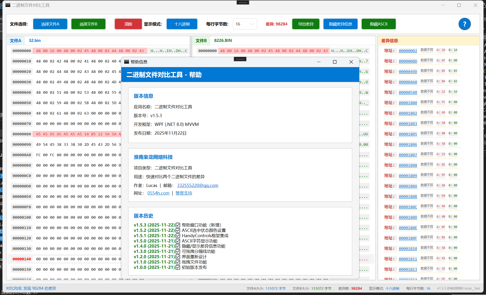

# 二进制文件对比工具

一个用于对比两个二进制文件的数据差异, 双文件对比、十六进制显示、差异高亮、详细差异信息列表。

## 快速信息

- **项目名称**：二进制文件对比工具（BinCompare）
- **版本**：v1.6.1
- **开发语言**：C# 12.0
- **框架**：WPF + .NET 8.0
- **架构模式**：MVVM
- **开发者**：XLucasen
- **GitHub**：[XLucasen](https://github.com/XLucasen)
- **开发日期**：2025年11月22日

## 应用截图



*应用程序主界面展示：双文件对比、十六进制显示、差异高亮、详细差异信息列表*

## 功能特性

### 核心功能
- ✅ **双文件对比**：同时打开并对比两个.BIN二进制文件
- ✅ **多种显示模式**：支持十六进制和二进制两种显示格式
- ✅ **灵活的行长度**：可选择每行显示8、16、32或64字节
- ✅ **差异高亮**：自动标记和高亮显示文件间的差异位置
  - 差异字节显示为浅红色背景 + 红色文字
  - 点击差异列表时，对应字节以黄色背景临时高亮（2秒后自动取消）
- ✅ **详细差异信息**：显示所有差异的十六进制地址、类型和具体值
- ✅ **快速导航**：点击差异地址可自动滚动到对应位置
- ✅ **滚动同步**：两个文件内容区域自动同步滚动
- ✅ **拖拽加载**：直接拖拽文件到显示区域快速打开

### 用户界面
- **顶部文件选择区**：快速选择和加载文件A和文件B
- **显示控制区**：切换显示模式、调整每行字节数、查看差异总数
- **主对比区**：左右两列分别显示文件A和文件B的内容
- **差异信息区**：列出所有发现的差异及其详细信息

### 键盘快捷键
- `Ctrl+O`：打开文件A
- `Ctrl+Shift+O`：打开文件B
- `Ctrl+H`：切换显示模式（十六进制/二进制）
- `Ctrl+E`：导出差异报告
- `Delete`：清除所有数据

## 项目结构

```
BinCompare/
├── Models/
│   └── BinaryFileData.cs          # 数据模型（文件数据、差异信息、数据行）
├── ViewModels/
│   ├── MainWindowViewModel.cs     # 主窗口ViewModel（业务逻辑）
│   ├── ViewModelBase.cs           # ViewModel基类
│   └── RelayCommand.cs            # 命令实现
├── Services/
│   └── BinaryCompareService.cs    # 二进制对比服务
├── Converters/
│   └── DifferenceColorConverter.cs # 值转换器（颜色映射）
├── MainWindow.xaml                # 主窗口UI
├── MainWindow.xaml.cs             # 主窗口代码后台
├── App.xaml                       # 应用程序资源
├── BinCompare.csproj              # 项目文件
├── README.md                      # 项目文档（本文件）
├── QUICKSTART.md                  # 快速开始指南
├── FEATURES.md                    # 详细功能说明
├── PROJECT_SUMMARY.md             # 项目技术总结
├── Rs/                            # 资源文件夹
│   └── 微信图片_20251122015906.png # 应用截图
└── TestFiles/
    ├── TestFileA.bin              # 测试文件A
    └── TestFileB.bin              # 测试文件B
```

## 技术栈

- **框架**：WPF (Windows Presentation Foundation)
- **语言**：C# 12.0
- **目标框架**：.NET 8.0
- **架构模式**：MVVM (Model-View-ViewModel)
- **编译状态**：✅ 成功编译（28个警告，0个错误）

## 使用指南

### 基本操作

1. **加载文件**
   - **方法一**：点击"选择文件A"按钮，选择第一个二进制文件
   - **方法二**：直接拖拽文件到左侧"文件A"显示区域
   - 同样方式加载文件B
   - 文件加载后会自动进行对比

2. **查看对比结果**
   - 左列显示文件A的内容，右列显示文件B的内容
   - 有差异的行会以浅红色背景高亮显示
   - 差异字节显示为红色文本

3. **切换显示格式**
   - 点击"切换为..."按钮在十六进制和二进制格式间切换
   - 十六进制格式显示为大写的0-9、A-F
   - 二进制格式显示为8位的0和1

4. **调整每行字节数**
   - 从下拉菜单选择每行显示的字节数（8、16、32或64）
   - 选择后界面会自动刷新

5. **查看差异信息**
   - 右侧差异信息区列出所有发现的差异
   - 每条差异显示：地址、类型、文件A的值、文件B的值
   - 点击地址可快速跳转到该位置

6. **导出差异报告**
   - 点击"导出差异"按钮
   - 选择保存位置和文件名
   - 生成包含所有差异详情的文本报告

7. **清除数据**
   - 点击"清除"按钮或按Delete键
   - 清除所有已加载的文件和对比结果

### 差异类型说明

- **数据不同**：两个文件在该位置的字节值不同
- **文件A超出**：文件A比文件B长，该位置文件B已结束
- **文件B超出**：文件B比文件A长，该位置文件A已结束
- **超出范围**：两个文件都已结束，但长度不同

## 编译和运行

### 前置条件
- .NET 8.0 SDK 或更高版本
- Windows 操作系统（WPF仅支持Windows）

### 编译
```bash
dotnet build
```

### 运行
```bash
dotnet run
```

### 发布
```bash
dotnet publish -c Release
```

## 测试

项目包含两个测试文件用于演示：
- `TestFileA.bin`：包含"Hello World!"及填充字节
- `TestFileB.bin`：与A文件有2处差异

## 性能特性

- 支持大文件对比（内存加载）
- 高效的差异检测算法（O(n)时间复杂度）
- 流畅的UI响应和滚动同步

## 已知限制

- 文件完全加载到内存中（适合中等大小文件）
- 不支持实时文件监控
- 单次对比限制为两个文件

## 未来改进方向

- [ ] 支持流式处理大文件
- [ ] 添加文件差异的二进制编辑功能
- [ ] 支持多文件对比
- [ ] 添加差异过滤和搜索功能
- [ ] 支持不同编码格式显示
- [ ] 添加对比历史记录

## 许可证

MIT License

## 作者

**XLucasen**

- GitHub：[https://github.com/XLucasen](https://github.com/XLucasen)
- 开发日期：2025年11月22日

## 版本历史

### v1.5.3 (2025-11-22)
- ✨ 完整的项目文档和GitHub集成
- 📸 添加应用界面截图
- 📚 完善版本历史记录

### v1.1.0 (2025-11-21)
- ✨ 新增拖拽文件加载功能
- 🎯 支持直接拖拽文件到显示区域
- 🎨 拖拽时视觉反馈（边框高亮）
- 📝 完整的拖拽功能文档

### v1.0.0 (2025-11-21)
- ✅ 初始版本发布
- 🎯 双文件对比功能
- 🔍 十六进制和二进制显示
- 📊 差异自动检测和高亮
- ⌨️ 3个键盘快捷键
- 📤 差异导出功能
- 📚 完整的项目文档

## 相关文档

本项目包含以下完整文档：

### 主要文档
- **README.md** - 项目总体介绍和使用指南（本文件）
- **QUICKSTART.md** - 快速开始指南
- **FEATURES.md** - 详细功能说明
- **PROJECT_SUMMARY.md** - 项目技术总结

### 详细文档（Doc文件夹）
- **INDEX.md** - 文档索引和快速导航
- **DELIVERY_SUMMARY.md** - 项目交付总结
- **VERIFICATION_CHECKLIST.md** - 验证清单和测试报告
- **UPDATE_NOTES.md** - 更新说明
- **DRAG_DROP_FEATURE.md** - 拖拽功能详细说明
- **UI_REDESIGN.md** - UI设计说明
- **HELP_WINDOW_FEATURE.md** - 帮助窗口功能
- **COMPLETION_REPORT.md** - 完成报告
- **STATUS_REPORT.md** - 状态报告

### 其他参考文档
- **QUICK_REFERENCE.md** - 快速参考
- **FEATURE_SUMMARY.md** - 功能总结
- **HANDYCONTROLS_SETUP.md** - HandyControls设置
- **HANDYCONTROLS_QUICK_START.md** - HandyControls快速开始
- **ASCII_SELECTION_COLOR.md** - ASCII选择颜色说明
- **SPLITTER_FEATURE.md** - 分割线功能说明
- **TOGGLE_DIFFERENCE_PANEL.md** - 差异面板切换说明
